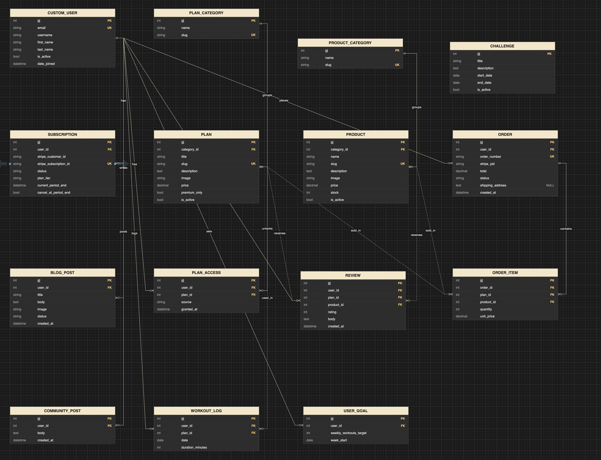
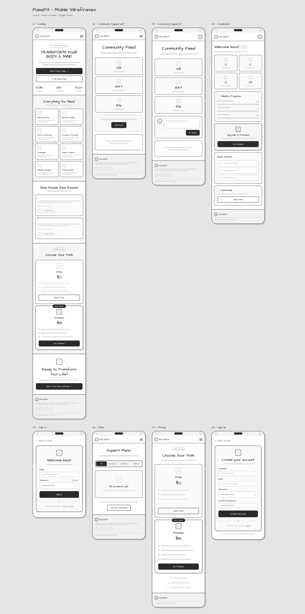
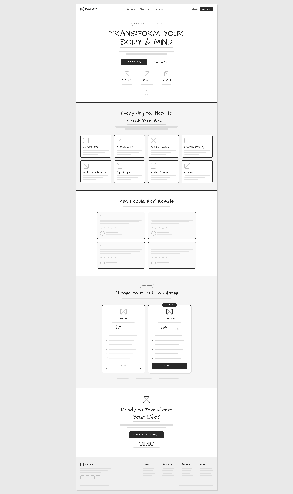
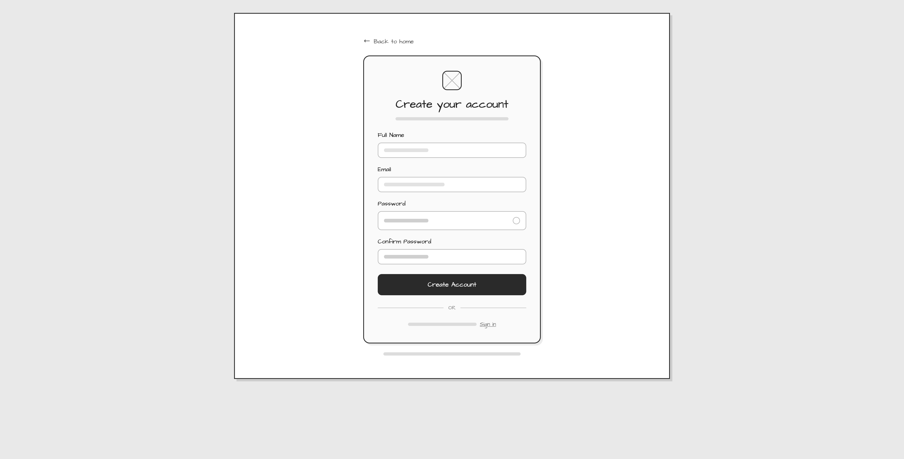
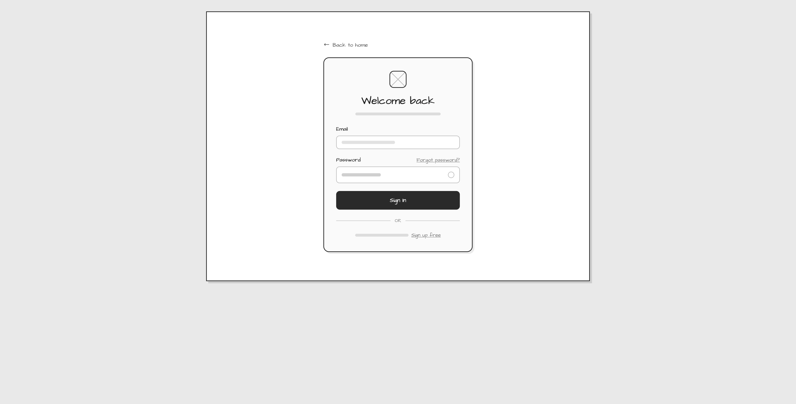
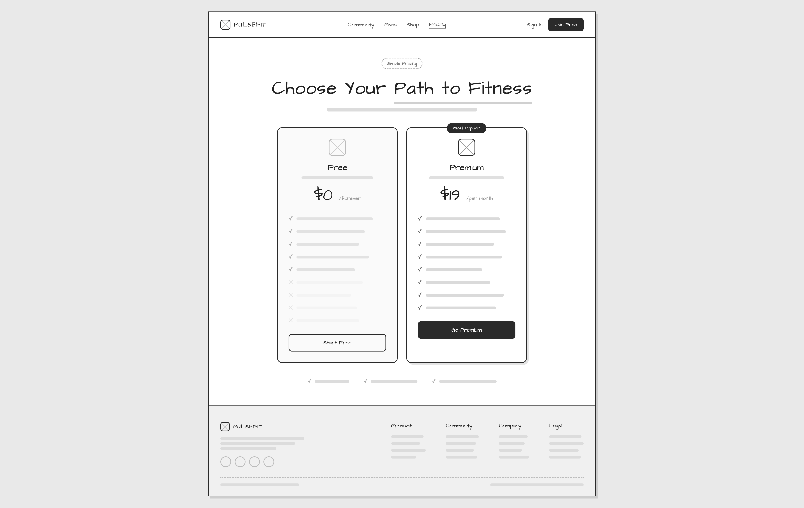
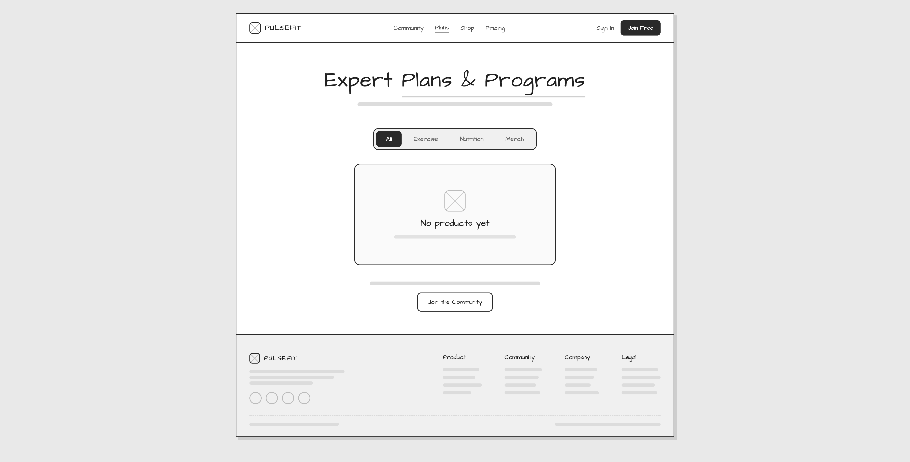
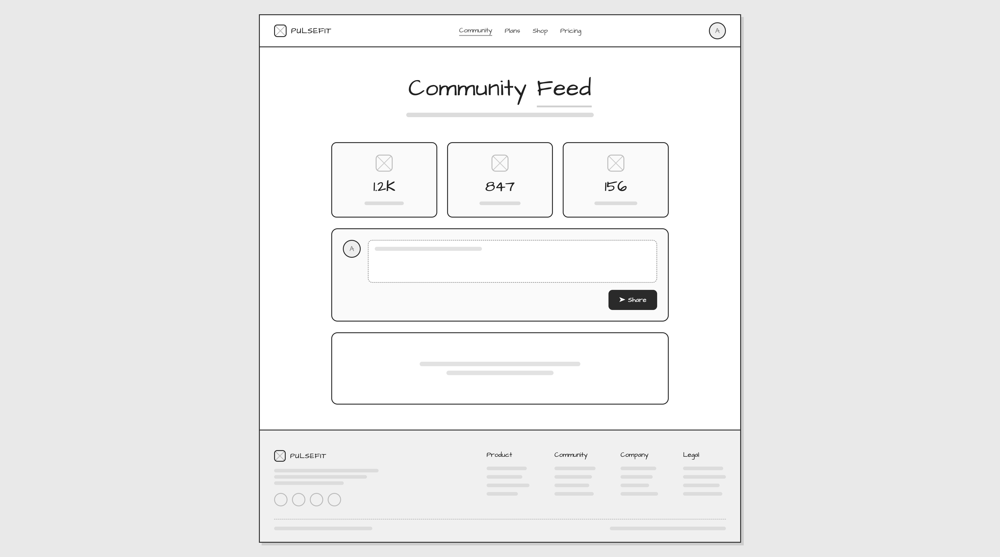
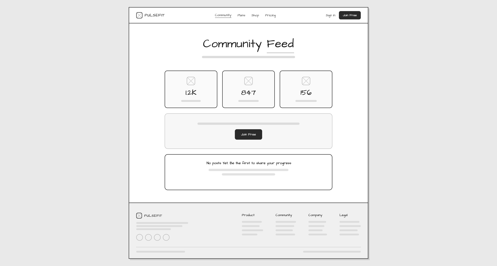
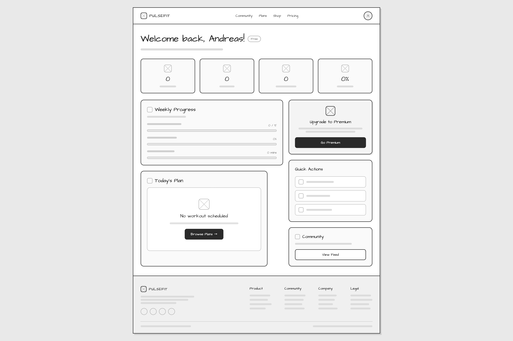

# Pulsefit

A subscription-based fitness platform combining digital training plans with an integrated e-commerce store for fitness products.

## Overview

External users' goal: Discover and follow training plans, manage their subscription, purchase fitness products, and read or write reviews to make informed decisions.

---

Site owner's goal: Build a recurring-revenue fitness brand by combining premium training content with complementary product sales, while nurturing an engaged community around health and fitness.

## Objectives

- Deliver a tiered subscription service that gives users access to premium training plans through Stripe-managed billing
- Provide an integrated e-commerce experience for purchasing fitness-related products alongside the subscription
- Allow flexible access models so users can unlock plans through subscription, one-time purchase, or promotional grants
- Enable users to browse, filter, and search both training plans and products by category
- Build trust through user-generated reviews on both plans and products
- Engage users with editorial blog content covering training tips, nutrition, and fitness news
- Ensure secure authentication and reliable subscription state synchronization between Stripe and the platform

## Business Model

PulseFit is a business-to-consumer (B2C) fitness platform that sells structured
training content and related physical products to people who want to train with
a clear plan rather than piece workouts together themselves. Its customers range
from beginners looking for a guided starting point to committed trainees who want
progressive programming, and the site is built to turn casual visitors into
paying customers and, ideally, into recurring members.

The platform earns revenue in three ways. First, individual digital training
plans are sold as one-time purchases through Stripe Checkout; once bought, a plan
is owned permanently by the customer. Second, a physical shop sells equipment,
nutrition, and merchandise as one-time purchases through the same checkout flow.
Third, a Premium membership is offered as a recurring Stripe subscription: while
the subscription is active it unlocks the entire premium plan catalogue, and that
access is automatically revoked if the membership lapses. This mix balances
predictable recurring revenue from memberships against transactional income from
one-off plan and product sales.

Around these paid offerings, PulseFit uses free content and community features to
drive acquisition and retention rather than to generate direct revenue. A blog
and a public community feed attract and engage visitors, member reviews provide
social proof that supports purchase decisions, challenges encourage repeat
engagement, and an email newsletter (via Mailchimp) gives the business a direct
marketing channel to nurture leads and bring customers back. Together these lower
the cost of acquiring each paying customer and raise the lifetime value of
members and buyers.

## Design

### Wireframes





















### Color Palette

Orange drives action. Deep neutrals carry the interface. Semantic hues stay reserved for meaning.

**Brand colors:**
Pulse Orange: Gradient #FF8A3D → #FB6E1E (Logo, primary CTAs, glow)
Orange 500: #FB6E1E (Primary action)
Orange 600: #EA580C (Hover / pressed)
Orange 300: #FFB07C (Accent text on dark)

**Neutral colors:**
Base: #080808
Surface 1: #121214
Surface 2: #1C1C20
Border: #2A2A2E
Text 2: #A1A1AA
Text 1: #FAFAFA

**Semantic colors:**
Success: #22C55E
Danger: #EF4444
Accent Violent: #AB5CF6

### Typography

Display & Headings: Sora weights 400-800
Body & UI: DM Sans weights 400-600

Transform: Display Sora 800 56/64 -1.5px
Heading 1: H1 Sora 700 40/48
Heading 2: H2 Sora 700 30/38
Heading 3: H3 Sora 600 22/30
Body large: Dm Sans 400 18/28
Body default: 16/26
Label/eyebrow: 12 1.5px upper

### Spacing, radius & elevation

#### Spacing scale

4 - xs
8 - sm
12 - md
16 - base
24 - lg
32 - xl
48 - 2xl
64 - 3xl

#### Corner Radius

8 - inputs
12 - buttons
18 - cards
full - pills avatars

#### Elevation

flat - border only
glow - primary focus

### Responsive layouts

The UI is built entirely from custom CSS design tokens — no Bootstrap — so each
breakpoint is hand-tuned to match the wireframes rather than overriding a
framework's defaults.

| Landing | Plans | Plan detail | Shop | Dashboard |
| --- | --- | --- | --- | --- |
|  |  |  |  |  |

## Features

Every feature below is live in the deployed app. Screenshots are grouped by
area, and the user story each one satisfies is noted in italics.

### Landing page

Marketing landing page served at `/`. The hero stats (member count, workouts
logged, plans available) and the testimonials are read live from the database,
not hard-coded. _US-39_


### Authentication & account

Email-based authentication via django-allauth — accounts log in with an email
address, there are no usernames.

**Register** · _US-01_


**Log in** · _US-02_


**Log out** · _US-03_


**Password reset flow** · _US-04_


### Plans & programs

**Plan catalogue** · _US-05_


**Plan detail** · _US-06_


### Content gating

Premium plans are locked behind an active subscription or an individual
purchase. The same page renders three states depending on the visitor. _US-17,
US-18_

| Locked (visitor) | Locked (signed-in, non-premium) | Unlocked (access granted) |
| --- | --- | --- |
|  |  |  |

### Shop

**Product catalogue** · _US-07_


**Product detail** · _US-08_


### Reviews

Signed-in members who own or have unlocked an item can leave a star rating and
written review. _US-28_


### Cart & checkout

**Cart** · _US-09, US-10_


**Add-to-cart feedback** · _US-38_


**Stripe Checkout (test mode)** · _US-11_


**Order confirmation** · _US-11, US-12_


**Cancelled checkout**


### Subscriptions

**Pricing** · _US-13_


**Manage subscription** · _US-14, US-15_


### Dashboard & progress tracking

**Personal dashboard** · _US-19_


**Log a workout** · _US-20_


**Set a weekly goal** · _US-21_


### Community

**Feed** · _US-22_


**Create a post** · _US-23_


**Delete own post** · _US-24_


### Blog

**Blog list** · _US-25_


**Blog post** · _US-26_


### Challenges

**Challenges** · _US-31_


### Navigation & premium state

The navigation bar adapts to authentication and premium status via the
`subscription_status` context processor.

| Signed out | Signed in (non-premium) | Premium |
| --- | --- | --- |
|  |  |  |

### Admin & store management

Staff manage the catalogue, orders and content from the Django admin.

**Admin index**


**Manage plans** · _US-29_


**Manage products** · _US-29_


**Manage orders** · _US-30_


**Manage challenges** · _US-31_


**Publish blog posts** · _US-27_


### SEO & marketing

**Newsletter sign-up** · _US-35_


**sitemap.xml** · _US-33_


**robots.txt** · _US-34_


### Defensive design

**404 – Not Found** · _US-36_


**500 – Server Error** · _US-37_


## EPIC 1 — Authentication & User Account

### US-01 - Register an account

**Label:** `must-have` `epic: authentication`

**User Story**
As a **visitor**, I can **register a new account with my name, email and password** so that **I can access member features and track my fitness journey**.

#### Acceptance Criteria

- Registration form requires: Full Name, Email, Password, Confirm Password
- Email must be unique — duplicate email shows a error message
- Password must meet minimum security requirements
- On success the user is automatically signed in and redirected to dashboard
- "Sign in" link is visible on the registration page for existing users

#### Tasks

- Configure `django-allauth` with email as the primary identifier
- Create `CustomUser` model extending `AbstractUser` with email `UNIQUE`
- Build registration template
- Apply design system styles
- Write form validation and error display
- Redirect to dashboard on successful registration

---

### US-02 - Sign in to existing account

**Label:** `must-have` `epic: authentication`

**User Story**
As a **registered user**, I can **sign in with my email and password** so that **I can access my personal dashboard and purchased content**.

**Acceptance Criteria**

- Login form has Email and Password fields plus a show/hide password toggle
- "Forgot password?" link is visible and functional
- Failed login shows a non-specific error (does not reveal whether email exists)
- Successful login redirects to the dashboard
- "Sign up free" link is visible for new visitors

#### Tasks

- Configure allauth login view with email backend
- Build login template matching wireframe (Welcome back, email field, password + eye icon, Sign In CTA, OR divider, Sign up free link)
- Handle failed login error messaging
- Set `LOGIN_REDIRECT_URL` to dashboard

---

### US-03 - Sign out

**Label:** `must-have` `epic: authentication`

**User Story**
As a **signed-in user**, I can **sign out of my account** so that **my session is closed and my account is secure**.

**Acceptance Criteria**

- Sign out is accessible from the navigation (avatar/profile menu)
- Signing out destroys the session and redirects to the home page
- Signed-out users cannot access protected pages

**Tasks**

- Add sign-out link/button to nav
- Configure allauth `ACCOUNT_LOGOUT_REDIRECT_URL` to home page
- Protect all private views with `@login_required`

---

### US-04 - Reset forgotten password

**Label:** `should-have` `epic: authentication`

**User Story**
As a **registered user who has forgotten my password**, I can **request a password reset email** so that **I can regain access to my account**.

**Acceptance Criteria**

- "Forgot password?" link on the login page leads to a reset form
- Entering a registered email sends a reset link to that address
- Reset link expires after a set period
- User can set a new password from the link

**Tasks**

- Enable allauth password reset flow
- Style password reset email template
- Configure email backend (console backend in dev, real SMTP in production)

---

## EPIC 2 — Plans & Programs Catalog

### US-05 - Browse plans and programs

**Label:** `must-have` `epic: catalog`

**User Story**
As a **visitor or member**, I can **browse all available plans and programs** so that **I can discover training and nutrition content that fits my goals**.

**Acceptance Criteria**

- Catalog page shows all active plans in a card grid
- Each card shows: plan image placeholder, title, category, price
- Filter tabs (All / Exercise / Nutrition) filter results without page reload
- Empty state ("No plans yet") is shown when no plans match a filter
- Page is accessible without signing in

**Tasks**

- Create `plans` app with `Plan` and `PlanCategory` models
- Build catalog list view with queryset filtered by `is_active=True`
- Implement filter tabs using URL params or lightweight JS
- Build plan card component using design system (Surface 1 card, 18px radius, feature card pattern)
- Add empty state component

---

### US-06 - View plan detail page

**Label:** `must-have` `epic: catalog`

**User Story**
As a **visitor or member**, I can **view a full detail page for a plan** so that **I can understand what is included before deciding to purchase or subscribe**.

**Acceptance Criteria**

- Detail page shows: title, description, price, category, premium_only badge if applicable
- Premium-only plans display a "Go Premium" CTA for non-subscribers
- Purchased/subscribed users see an "Access Content" button instead
- Slug-based URL (e.g. `/plans/12-week-strength/`)

**Tasks**

- Build `PlanDetailView` using slug lookup
- Add `premium_only` conditional rendering logic
- Check `PLAN_ACCESS` table to determine if user already has access
- Link "Add to Cart" for one-time purchasable plans

---

### US-07 - Browse the shop (physical & digital products)

**Label:** `must-have` `epic: catalog`

**User Story**
As a **visitor or member**, I can **browse the shop** so that **I can find and purchase physical merchandise and digital products**.

**Acceptance Criteria**

- Shop page lists all active products in a card grid
- Filter tabs include: All / Exercise / Nutrition / Merch
- Each card shows name, price, stock indicator
- Out-of-stock products are visually distinguished

**Tasks**

- Create `products` app with `Product` and `ProductCategory` models
- Build shop list view filtered by `is_active=True`
- Add filter tabs (mirroring plans catalog pattern)
- Display stock status on card

---

### US-08 - View product detail page

**Label:** `must-have` `epic: catalog`

**User Story**
As a **visitor or member**, I can **view a product detail page** so that **I can read the full description and add it to my cart**.

#### Acceptance Criteria

- Detail page shows: name, description, price, stock level, "Add to Cart" button
- "Add to Cart" is disabled when `stock = 0`
- Slug-based URL

#### Tasks

- Build `ProductDetailView`
- Disable "Add to Cart" CTA when `stock = 0`
- Wire up "Add to Cart" to session cart

---

## EPIC 3 — Cart & Checkout

### US-09 - Add items to cart

**Label:** `must-have` `epic: cart-checkout`

**User Story**
As a **visitor or signed-in user**, I can **add plans and products to a cart** so that **I can purchase multiple items in one transaction**.

**Acceptance Criteria**

- Items can be added from both plan detail and product detail pages
- Cart persists in the session (no login required to add items)
- Cart icon in the nav shows the current item count
- Adding the same item again increases the quantity

**Tasks**

- Implement session-based cart (`request.session['cart']`)
- Build `add_to_cart` view for both plans and products
- Update cart count in nav via template context processor

---

### US-10 - View and edit cart

**Label:** `must-have` `epic: cart-checkout`

**User Story**
As a **shopper**, I can **view my cart and update quantities or remove items** so that **I can finalise what I want to buy before paying**.

**Acceptance Criteria**

- Cart page lists each item with name, unit price, quantity, line total
- Quantity can be increased or decreased
- Items can be removed individually
- Order total updates dynamically
- "Proceed to Checkout" CTA is visible

**Tasks**

- Build cart view rendering session data
- Build `update_cart` and `remove_from_cart` views
- Calculate and display order total

---

### US-11 - Complete a one-time purchase checkout

**Label:** `must-have` `epic: cart-checkout`

**User Story**
As a **shopper**, I can **pay for my cart via Stripe** so that **I receive digital access or physical items I have purchased**.

**Acceptance Criteria**

- Checkout flow collects shipping address (for physical products)
- Payment is processed via Stripe Checkout or Payment Intents
- Successful payment creates an `ORDER` and `ORDER_ITEM` record
- User is redirected to a success page with order summary
- Failed payment shows a clear error and does not create an order

**Tasks**

- Integrate Stripe (install `stripe`, add keys to environment)
- Build checkout view and Stripe session creation
- Build Stripe webhook handler for `checkout.session.completed`
- Create `ORDER` and `ORDER_ITEM` on webhook success
- Build order success and cancel pages

---

### US-12 - Receive order confirmation email

**Label:** `should-have` `epic: cart-checkout`

**User Story**
As a **customer who has just purchased**, I can **receive an order confirmation email** so that **I have a record of my purchase**.

**Acceptance Criteria**

- Confirmation email is sent after Stripe webhook confirms payment
- Email includes: order number, item list, total paid, date

**Tasks**

- Build order confirmation email template
- Trigger email send from webhook handler
- Configure email backend for production (SendGrid / SES)

---

## EPIC 4 — Subscriptions

### US-13 - Subscribe to Premium plan

**Label:** `must-have` `epic: subscriptions`

**User Story**
As a **registered user**, I can **subscribe to PulseFit Premium via Stripe** so that **I unlock all premium plans and content for a monthly fee**.

**Acceptance Criteria**

- Pricing page shows Free and Premium tiers clearly (Free $0 / Premium $19/mo)
- "Go Premium" CTA initiates Stripe Subscription checkout
- Successful subscription creates a `SUBSCRIPTION` record with `status='active'` and correct `plan_tier`
- A `PLAN_ACCESS` record with `source='subscription'` is created for all premium plans
- User dashboard reflects premium status immediately

**Tasks**

- Create Stripe subscription product and price in Stripe dashboard
- Build subscription checkout view
- Handle `customer.subscription.created` webhook
- Write `SUBSCRIPTION` and `PLAN_ACCESS` creation logic
- Update nav to show premium badge

---

### US-14 - View current subscription status

**Label:** `must-have` `epic: subscriptions`

**User Story**
As a **subscriber**, I can **see my subscription status on my dashboard** so that **I know when my subscription renews and whether it is active**.

**Acceptance Criteria**

- Dashboard shows: plan tier, status (active / cancelled), next renewal date
- Cancelled subscriptions show end-of-access date (from `current_period_end`)

**Tasks**

- Read `SUBSCRIPTION` record and surface fields on dashboard template
- Handle `cancel_at_period_end=True` display state

---

### US-15 - Cancel subscription

**Label:** `should-have` `epic: subscriptions`

**User Story**
As a **subscriber**, I can **cancel my Premium subscription** so that **it does not renew at the end of the current period**.

**Acceptance Criteria**

- Cancel option is available from the dashboard
- Cancellation sets `cancel_at_period_end=True` via Stripe API
- User retains access until `current_period_end`
- Dashboard reflects "Cancels on [date]" state

**Tasks**

- Build cancel subscription view calling Stripe API
- Handle `customer.subscription.updated` webhook
- Update `SUBSCRIPTION.cancel_at_period_end` and `status` fields

---

### US-16 - Subscription renewal handled automatically

**Label:** `must-have` `epic: subscriptions`

**User Story**
As a **subscriber**, my **subscription renews automatically each month** so that **my premium access continues without manual action**.

**Acceptance Criteria**

- `invoice.payment_succeeded` webhook updates `current_period_end`
- `invoice.payment_failed` webhook sets subscription `status='past_due'`
- Access is revoked when status transitions to `cancelled` or `unpaid`

**Tasks**

- Handle `invoice.payment_succeeded` webhook
- Handle `invoice.payment_failed` webhook
- Write access revocation logic on `customer.subscription.deleted`

---

## EPIC 5 — Content Gating

---

### US-17 - Access premium plan content as a subscriber

**Label:** `must-have` `epic: content-gating`

**User Story**
As a **Premium subscriber**, I can **access all premium plan content** so that **I get full value from my subscription**.

**Acceptance Criteria**

- Plans with `premium_only=True` are unlocked for active subscribers
- `PLAN_ACCESS` table entry with `source='subscription'` grants access
- Non-subscribers see a paywall/upsell instead of the content

**Tasks**

- Write `has_plan_access(user, plan)` helper checking `PLAN_ACCESS`
- Apply helper in plan detail view to gate content display
- Build upsell/paywall component for non-subscribers

---

### US-18 - Access a plan purchased individually

**Label:** `must-have` `epic: content-gating`

**User Story**
As a **member who has purchased a plan one-time**, I can **access that specific plan's content** so that **I benefit from my individual purchase**.

**Acceptance Criteria**

- Completing checkout for a plan creates `PLAN_ACCESS` with `source='purchase'`
- Only the purchased plan is accessible — not all premium plans
- Access is permanent (not tied to subscription status)

**Tasks**

- Write `PLAN_ACCESS` creation logic in Stripe webhook for one-time plan purchases
- Ensure `has_plan_access` handles both `source='subscription'` and `source='purchase'`

---

## EPIC 6 — Dashboard & Progress Tracking

---

### US-19 - View personal dashboard

**Label:** `must-have` `epic: dashboard`

**User Story**
As a **signed-in user**, I can **see my personal dashboard** so that **I get an overview of my activity, plans, and subscription at a glance**.

**Acceptance Criteria**

- Dashboard shows: weekly workouts completed, total minutes logged, current streak, goal completion %
- "Today's Plan" section shows current active plan or "No workout scheduled" empty state
- "Weekly Progress" section shows progress toward `USER_GOAL.weekly_workouts_target`
- Free users see an "Upgrade to Premium" upsell card
- Quick Actions shortcut links are present

**Tasks**

- Build `DashboardView` with `@login_required`
- Query `WORKOUT_LOG` for current week's entries per user
- Query `USER_GOAL` for target vs. actual
- Render stat tiles: workouts, minutes, streak, completion %
- Show premium upsell card when `subscription.status != 'active'`

---

### US-20 - Log a workout

**Label:** `must-have` `epic: dashboard`

**User Story**
As a **signed-in user**, I can **log a completed workout** so that **my progress is tracked against my weekly goal**.

**Acceptance Criteria**

- Log form captures: plan (optional), date, duration in minutes
- Logged workouts appear in the Weekly Progress section
- Logging a workout updates the completion percentage on the dashboard

**Tasks**

- Build `WorkoutLogCreateView`
- Associate log entry with `user` and optionally `plan_id`
- Recalculate weekly progress in dashboard context

---

### US-21 - Set a weekly workout goal

**Label:** `should-have` `epic: dashboard`

**User Story**
As a **signed-in user**, I can **set a weekly workout target** so that **the dashboard tracks my progress toward that goal**.

**Acceptance Criteria**

- User can enter a number of workouts per week (e.g. 4)
- Goal is saved to `USER_GOAL` table
- Dashboard progress bar reflects the target

**Tasks**

- Build goal form (or inline edit on dashboard)
- Create or update `USER_GOAL` record for the user
- Use `weekly_workouts_target` in dashboard progress calculation

---

## EPIC 7 — Community

---

### US-22 - View community feed

**Label:** `must-have` `epic: community`

**User Story**
As a **visitor**, I can **browse the community feed** so that **I can see what members are sharing before deciding to join**.

**Acceptance Criteria**

- Community feed is publicly visible (read-only for visitors)
- Posts are shown in reverse chronological order
- Each post shows: author name, body text, timestamp
- Visitors see a "Join Free" CTA to encourage sign-up
- Empty state is shown if no posts exist yet

**Tasks**

- Build `CommunityFeedView` querying `COMMUNITY_POST` ordered by `-created_at`
- Build post card component
- Add signed-out CTA card above the feed
- Handle empty feed state

---

### US-23 - Create a community post

**Label:** `must-have` `epic: community`

**User Story**
As a **signed-in member**, I can **create a post in the community feed** so that **I can share my progress, tips, or questions with other members**.

**Acceptance Criteria**

- Post form is visible only to signed-in users
- Post requires a non-empty body (text)
- After posting, the new post appears at the top of the feed
- Author name and timestamp are displayed on the post

**Tasks**

- Build `CommunityPostCreateView` with `@login_required`
- Associate post with `request.user`
- Redirect to feed on success with success message

---

### US-24 - Delete own community post

**Label:** `should-have` `epic: community`

**User Story**
As a **signed-in member**, I can **delete my own posts** so that **I can remove content I no longer wish to share**.

**Acceptance Criteria**

- Delete button is visible only to the post author
- Confirmation is required before deletion
- Post is removed from the feed immediately

**Tasks**

- Build `CommunityPostDeleteView` with ownership check
- Add confirmation step (modal or confirm page)

---

## EPIC 8 — Blog

### US-25 - Browse blog posts

**Label:** `should-have` `epic: blog`

**User Story**
As a **visitor or member**, I can **read admin-published blog articles** so that **I can learn about fitness, nutrition, and training**.

**Acceptance Criteria**

- Blog listing page shows published posts in reverse chronological order
- Each listing shows: title, excerpt, image thumbnail, date
- Only posts with `status='published'` are shown

**Tasks**

- Build `BlogListView` filtered by `status='published'`
- Build blog card component

---

### US-26 - Read a blog post

**Label:** `should-have` `epic: blog`

**User Story**
As a **visitor or member**, I can **read a full blog post** so that **I get detailed fitness and nutrition guidance**.

**Acceptance Criteria**

- Detail page shows: title, body, image, author, date
- Slug-based URL

**Tasks**

- Build `BlogDetailView`

---

### US-27 - Publish a blog post (admin)

**Label:** `should-have` `epic: blog`

**User Story**
As a **site admin**, I can **create and publish blog posts from the Django admin** so that **content is kept fresh without needing a custom CMS**.

**Acceptance Criteria**

- `BLOG_POST` model is registered in Django admin
- Admin can set status to `draft` or `published`
- Published posts are immediately visible on the public blog

**Tasks**

- Register `BlogPost` in `admin.py` with list display and status filter
- Add `prepopulated_fields` for slug from title

---

## EPIC 9 — Reviews

---

### US-28 - Leave a review on a plan or product

**Label:** `should-have` `epic: reviews`

**User Story**
As a **member who has accessed a plan or purchased a product**, I can **leave a star rating and written review** so that **other members can make informed decisions**.

**Acceptance Criteria**

- Review form is visible only to users with `PLAN_ACCESS` or a completed order containing the item
- Form collects: rating (1–5), body text
- One review per user per plan/product (edit replaces previous)
- Average rating is displayed on the plan/product detail page

**Tasks**

- Build `ReviewCreateView` with access check
- Enforce one review per user per plan/product with `unique_together`
- Compute and display average rating on detail pages

---

## EPIC 10 — Admin & Store Management

---

### US-29 - Manage plans and products in Django admin

**Label:** `must-have` `epic: admin`

**User Story**
As a **site admin**, I can **create, edit, and deactivate plans and products from Django admin** so that **the catalog stays up to date without code changes**.

**Acceptance Criteria**

- `PLAN`, `PLAN_CATEGORY`, `PRODUCT`, `PRODUCT_CATEGORY` are all registered in admin
- Admin can toggle `is_active` to hide items from the catalog
- Slug fields are auto-populated from title/name
- Admin can set `premium_only` on plans

**Tasks**

- Register all catalog models in `admin.py`
- Add `list_display`, `list_filter`, `search_fields`, `prepopulated_fields` for each

---

### US-30 - View and manage orders in Django admin

**Label:** `must-have` `epic: admin`

**User Story**
As a **site admin**, I can **view all orders and their line items in Django admin** so that **I can handle fulfilment and customer queries**.

**Acceptance Criteria**

- `ORDER` and `ORDER_ITEM` are visible in admin
- Admin can filter orders by `status` and search by `order_number`
- Admin can update order `status` (e.g. mark as shipped)

**Tasks**

- Register `Order` and `OrderItem` with inline `OrderItem`
- Add `list_display` with order number, user, total, status, created_at
- Add `status` filter and `order_number` search

---

### US-31 - Manage challenges in Django admin

**Label:** `could-have` `epic: admin`

**User Story**
As a **site admin**, I can **create and manage fitness challenges** so that **members are motivated with time-limited group goals**.

**Acceptance Criteria**

- `CHALLENGE` model is registered in admin
- Admin can set title, description, start/end date, and toggle `is_active`

**Tasks**

- Register `Challenge` in admin
- Add date range filter

---

## EPIC 11 — SEO & Marketing

---

### US-32 - Site has descriptive meta tags

**Label:** `should-have` `epic: seo`

**User Story**
As a **site owner**, I want **every public page to have a descriptive title and meta description** so that **search engines index PulseFit accurately**.

**Acceptance Criteria**

- title tag is unique and descriptive per page
- meta description is set on all public pages
- Open Graph tags are present on key pages

**Tasks**

- Add `` and `` to base template
- Populate per template
- Add OG tags to base template

---

### US-33 - sitemap.xml is generated

**Label:** `should-have` `epic: seo`

**User Story**
As a **site owner**, I want **a sitemap.xml to be available** so that **search engine crawlers can discover all public pages**.

**Acceptance Criteria**

- `/sitemap.xml` returns a valid XML sitemap
- Sitemap includes: home, plans catalog, shop, blog posts, pricing

**Tasks**

- Install and configure `django.contrib.sitemaps`
- Register plan, product, and blog post sitemaps

---

### US-34 - robots.txt is served correctly

**Label:** `should-have` `epic: seo`

**User Story**
As a **site owner**, I want **a robots.txt file** so that **search engines know which parts of the site to crawl**.

**Acceptance Criteria**

- `/robots.txt` is accessible
- Admin and private URLs are disallowed

**Tasks**

- Serve `robots.txt` via a simple view or static file
- Disallow `/admin/`, `/accounts/`, `/dashboard/`, `/cart/`, `/orders/`, `/subscription/`

---

### US-35 - Newsletter sign-up

**Label:** `could-have` `epic: seo`

**User Story**
As a **visitor**, I can **sign up for the PulseFit newsletter** so that **I receive fitness tips and offers by email**.

**Acceptance Criteria**

- Newsletter sign-up form is present in the footer
- Submitting a valid email saves it or passes it to a third-party service (e.g. Mailchimp)
- Success message confirms sign-up

**Tasks**

- Build newsletter sign-up form and view
- Integrate with Mailchimp API or save email to a simple `NewsletterSubscriber` model

---

## EPIC 12 — UX & Error Handling

---

### US-36 - Informative 404 page

**Label:** `must-have` `epic: ux`

**User Story**
As a **user who navigates to a non-existent page**, I can **see a helpful 404 page** so that **I understand what happened and can find my way back**.

**Acceptance Criteria**

- Custom 404 page matches site design
- Page includes navigation back to home

**Tasks**

- Create `404.html` template in templates root
- Set `DEBUG=False` in production to serve custom error pages

---

### US-37 - Informative 500 page

**Label:** `must-have` `epic: ux`

**User Story**
As a **user who encounters a server error**, I can **see a friendly error page** so that **I know something went wrong and the team is aware**.

**Acceptance Criteria**

- Custom 500 page matches site design
- Page does not expose technical error details to the user

**Tasks**

- Create `500.html` template
- Verify it serves correctly in production (`DEBUG=False`)

---

### US-38 - Toast / flash messages for all key actions

**Label:** `should-have` `epic: ux`

**User Story**
As a **user**, I can **see a brief confirmation message after key actions** so that **I know my action was successful or if something went wrong**.

**Acceptance Criteria**

- Success messages shown after: login, logout, registration, add to cart, post created, workout logged, subscription started
- Error messages shown for: failed payment, form validation errors
- Messages are dismissible

**Tasks**

- Add Django messages framework to base template
- Style message toasts using design system (success = #22C55E, danger = #EF4444)
- Apply `messages.success` / `messages.error` in all relevant views

---

## MoSCoW Summary

| Priority | Count | User Stories |
| --- | --- | --- |
| **Must Have** | 18 | US-01–03, US-05–07, US-09–11, US-13–14, US-16–19, US-22–23, US-29–30, US-36–37 |
| **Should Have** | 13 | US-04, US-08, US-12, US-15, US-20–21, US-24–28, US-32–34, US-38 |
| **Could Have** | 3 | US-31, US-35, + further challenge tracking |
| **Won't Have** | — | Challenge progress tracking (deferred), social auth (deferred) |

---

| Milestone | User Stories |
| --- | --- |
| Sprint 1 — Foundation | US-01, US-02, US-03, US-36, US-37 |
| Sprint 2 — Catalog | US-05, US-06, US-07, US-08, US-29 |
| Sprint 3 — Cart & Checkout | US-09, US-10, US-11, US-12, US-30 |
| Sprint 4 — Subscriptions & Gating | US-13, US-14, US-15, US-16, US-17, US-18 |
| Sprint 5 — Dashboard & Community | US-19, US-20, US-21, US-22, US-23, US-24 |
| Sprint 6 — Blog, Reviews & SEO | US-25, US-26, US-27, US-28, US-32, US-33, US-34, US-38 |
| Sprint 7 — Polish & Could Haves | US-04, US-31, US-35 |

---

## Technologies Used

### Languages

- Python 3.12
- HTML5
- CSS3
- JavaScript

### Frameworks, Libraries & Tools

**Backend**

- Django 6.0.6
- django-allauth 65.18.0
- Stripe 15.3.0

**Database**

- PostgreSQL
- dj-database-url 3.1.2
- psycopg2-binary 2.9.12

**Deployment**

- Heroku
- Gunicorn 26.0.0
- WhiteNoise 6.12.0
- environs 15.0.1

**Design & Frontend**

- Custom CSS — no framework
- Google Fonts

**Version Control & Project Management**

- Git & GitHub (Issues for user story tracking)
- draw.io (ER diagram)

## Testing

# Manual Testing

These manual tests were run on the deployed Heroku application to verify that
every feature works correctly. Stripe flows were tested in test mode using card
`4242 4242 4242 4242` (success) and `4000 0000 0000 0002` (declined). Webhook
events were replayed with the Stripe CLI.

## Test Results

| Feature | Test | Action | Expected Result | Actual Result | Pass |
|---|---|---|---|---|---|
| **Navigation** | Brand link | Click the PulseFit logo in the header | Redirects to the home page from any page | As expected | ✅ |
| **Navigation** | Plans link | Click "Plans" in the header | Opens the plans catalog | As expected | ✅ |
| **Navigation** | Shop link | Click "Shop" in the header | Opens the shop | As expected | ✅ |
| **Navigation** | Blog link | Click "Blog" in the header | Opens the blog listing | As expected | ✅ |
| **Navigation** | Community link | Click "Community" in the header | Opens the community feed | As expected | ✅ |
| **Navigation** | Pricing link | Click "Pricing" in the header | Opens the pricing page | As expected | ✅ |
| **Navigation** | Cart icon | Click the cart icon | Opens the cart; badge shows the item count | As expected | ✅ |
| **Navigation** | Logged-out header | Load any page without signing in | Header shows only Sign In / Join Free, with no dashboard or post controls | As expected | ✅ |
| **Navigation** | Logged-in header | Sign in and load any page | Header shows the avatar linking to Dashboard, plus a Sign out button | As expected | ✅ |
| **Navigation** | Footer copyright | Load any page | Footer displays the © notice and site name | As expected | ✅ |
| **Navigation** | Footer links | Click each footer link | Product/Community links resolve to real pages; About/Contact/Privacy/Terms are placeholder `#` links (no 404) | As expected | ✅ |
| **Navigation** | External links | Click social / external links | Open in a new tab with `rel="noopener"` | As expected | ✅ |
| **Authentication** | Register: valid | Submit registration with valid name, email, password + confirm | Account created, auto-signed in, redirected to dashboard | As expected | ✅ |
| **Authentication** | Register: duplicate email | Submit with an email already in use | Duplicate-email error shown; no account created | As expected | ✅ |
| **Authentication** | Register: weak password | Submit with a password under 8 characters | Minimum-length error; form not submitted | As expected | ✅ |
| **Authentication** | Register: password mismatch | Submit with confirm ≠ password | Password-confirmation mismatch error shown | As expected | ✅ |
| **Authentication** | Register: sign-in link | View the register page | "Sign in" link is present and navigates to login | As expected | ✅ |
| **Authentication** | Login: valid | Sign in with correct email + password | Redirected to the dashboard | As expected | ✅ |
| **Authentication** | Login: invalid | Sign in with a wrong password | Generic error that does not reveal whether the email exists | As expected | ✅ |
| **Authentication** | Login: password toggle | Click the show/hide toggle button | Password text toggles between masked and visible | As expected | ✅ |
| **Authentication** | Logout | Click Sign out in the header | Session destroyed, redirected to the home page | As expected | ✅ |
| **Authentication** | Password reset: request | Submit a registered email on "Forgot password?" | Reset email is sent | As expected | ✅ |
| **Authentication** | Password reset: complete | Follow the link and set a new password | New password accepted; user can sign in with it | As expected | ✅ |
| **Authentication** | Password reset: expired link | Reuse an expired / used reset link | Link rejected with an appropriate message | As expected | ✅ |
| **Plans Catalog** | Browse plans | Open the catalog while signed out | All active plans shown in a card grid; loads without login | As expected | ✅ |
| **Plans Catalog** | Card fields | Inspect a plan card | Image, title, category and price all render | As expected | ✅ |
| **Plans Catalog** | Filter tabs | Click All / Exercise / Nutrition | Results filter by category without a page reload | As expected | ✅ |
| **Plans Catalog** | Empty state | Apply a filter with no matching plans | "No plans yet" empty state is shown | As expected | ✅ |
| **Plans Catalog** | Plan detail | Open a plan via its slug URL | Title, description, price and category render | As expected | ✅ |
| **Plans Catalog** | Premium plan (free user) | View a `premium_only` plan as a non-subscriber | "Go Premium" CTA and premium badge shown | As expected | ✅ |
| **Plans Catalog** | Plan with access | View a plan the user already owns | "Access Content" button shown instead of the CTA | As expected | ✅ |
| **Shop** | Browse shop | Open the shop while signed out | All active products shown in a card grid | As expected | ✅ |
| **Shop** | Filter tabs | Click All / Exercise / Nutrition / Merch | Products filter by category | As expected | ✅ |
| **Shop** | Out of stock | View an out-of-stock product | Product is visually distinguished as out of stock | As expected | ✅ |
| **Shop** | Product detail | Open a product via its slug | Name, description, price, stock and Add to Cart render | As expected | ✅ |
| **Shop** | Add to cart disabled | View a product with `stock = 0` | "Add to Cart" button is disabled | As expected | ✅ |
| **Cart** | Add plan | Add a plan from its detail page | Item added; nav cart count increments | As expected | ✅ |
| **Cart** | Add product | Add a product from its detail page | Item added; nav cart count increments | As expected | ✅ |
| **Cart** | Add duplicate | Add the same item twice | Quantity increases; no duplicate line | As expected | ✅ |
| **Cart** | Session cart | Add items while signed out | Cart persists in the session (no login required) | As expected | ✅ |
| **Cart** | View cart | Open the cart page | Each item shows name, unit price, quantity and line total | As expected | ✅ |
| **Cart** | Update quantity | Increase / decrease a quantity | Quantity and order total update | As expected | ✅ |
| **Cart** | Remove item | Remove an item | Item removed; total recalculated | As expected | ✅ |
| **Checkout** | Successful payment | Check out with card `4242 4242 4242 4242` | ORDER + ORDER_ITEM created; success page with summary | As expected | ✅ |
| **Checkout** | Declined card | Check out with card `4000 0000 0000 0002` | Clear payment error; no order created | As expected | ✅ |
| **Checkout** | Shipping address | Check out with a physical product | Shipping address fields collected | As expected | ✅ |
| **Checkout** | Confirmation email | Complete a purchase | Email sent with order number, items, total and date | As expected | ✅ |
| **Subscriptions** | Pricing tiers | Open the pricing page | Free $0 and Premium $19/mo shown clearly | As expected | ✅ |
| **Subscriptions** | Subscribe | Click "Go Premium" and complete Stripe checkout | SUBSCRIPTION created with `status='active'` and correct tier | As expected | ✅ |
| **Subscriptions** | Premium unlocked | Return to the app after subscribing | PLAN_ACCESS (`source='subscription'`) created; dashboard shows premium | As expected | ✅ |
| **Subscriptions** | Status display | View the dashboard as an active subscriber | Plan tier, active status and next renewal date shown | As expected | ✅ |
| **Subscriptions** | Cancelled display | View the dashboard after cancelling | End-of-access date shown (from `current_period_end`) | As expected | ✅ |
| **Subscriptions** | Cancel | Cancel via the Stripe billing portal (from the subscription page) | `cancel_at_period_end=True` set; "Cancels on [date]" shown | As expected | ✅ |
| **Subscriptions** | Access after cancel | Access premium content after cancelling | Content still accessible until the period ends | As expected | ✅ |
| **Subscriptions** | Renewal success | Replay `invoice.payment_succeeded` via Stripe CLI | `current_period_end` updated | As expected | ✅ |
| **Subscriptions** | Renewal failure | Replay `invoice.payment_failed` | Status set to `past_due` | As expected | ✅ |
| **Subscriptions** | Subscription deleted | Replay `customer.subscription.deleted` | Access revoked | As expected | ✅ |
| **Content Gating** | Subscriber access | Open a premium plan as an active subscriber | Full premium content is accessible | As expected | ✅ |
| **Content Gating** | Free user gated | Open the same plan as a free user | Paywall / upsell shown; content withheld | As expected | ✅ |
| **Content Gating** | Individual purchase | Buy a single plan and open it | PLAN_ACCESS (`source='purchase'`) created; that plan accessible | As expected | ✅ |
| **Content Gating** | Scope of access | Check other premium plans after one purchase | Other premium plans remain gated | As expected | ✅ |
| **Content Gating** | Persistence | Check the purchased plan regardless of subscription state | Stays accessible | As expected | ✅ |
| **Dashboard** | Stats render | Open the dashboard while signed in | Weekly workouts, minutes, streak and goal % render | As expected | ✅ |
| **Dashboard** | Empty today's plan | View with no active plan | "No workout scheduled" empty state shown | As expected | ✅ |
| **Dashboard** | Free upsell | View the dashboard as a free user | "Upgrade to Premium" card shown | As expected | ✅ |
| **Dashboard** | Quick actions | Click the Quick Actions shortcuts | Shortcut links work | As expected | ✅ |
| **Dashboard** | Log workout | Submit the log form (plan optional, date, duration) | Workout appears in Weekly Progress; completion % updates | As expected | ✅ |
| **Dashboard** | Log without plan | Log a workout with no plan selected | Saved with plan left null | As expected | ✅ |
| **Dashboard** | Set goal | Set a weekly workout target | USER_GOAL saved; progress bar reflects it | As expected | ✅ |
| **Dashboard** | Update goal | Change an existing goal | Existing record updated, not duplicated | As expected | ✅ |
| **Community** | Feed signed out | Open the feed while signed out | Posts read-only, newest first; "Join Free" CTA shown | As expected | ✅ |
| **Community** | Empty feed | View the feed with no posts | Empty state shown | As expected | ✅ |
| **Community** | Post fields | Inspect a post | Author, body and timestamp render | As expected | ✅ |
| **Community** | Create post | Submit a post while signed in | Post appears at the top with author + timestamp | As expected | ✅ |
| **Community** | Empty post | Submit an empty body | Rejected; a non-empty body is required | As expected | ✅ |
| **Community** | Form hidden signed out | View the feed while signed out | Post form is not visible to visitors | As expected | ✅ |
| **Community** | Delete own post | Delete your own post (with confirmation) | Post removed from the feed immediately | As expected | ✅ |
| **Community** | Delete control scope | View other members' posts | Delete button only visible on your own posts | As expected | ✅ |
| **Community** | Delete guard | Delete another user's post via a crafted URL | Rejected (ownership check) | As expected | ✅ |
| **Blog** | Browse blog | Open the blog listing | Published posts newest first with title, excerpt, thumbnail, date | As expected | ✅ |
| **Blog** | Drafts hidden | Check for draft posts | Only `status='published'` posts appear | As expected | ✅ |
| **Blog** | Read post | Open a post via its slug | Title, body, image, author and date render | As expected | ✅ |
| **Blog** | Publish (admin) | Publish a post in Django admin | Post immediately visible on the public blog | As expected | ✅ |
| **Blog** | Slug autofill | Create a post in admin | Slug auto-populates from the title | As expected | ✅ |
| **Reviews** | Leave review | Submit rating + review as a user with access | Review saved; average rating shown on the detail page | As expected | ✅ |
| **Reviews** | Review gating | View the form without access | Form hidden unless PLAN_ACCESS or a completed order exists | As expected | ✅ |
| **Reviews** | One per item | Submit a second review for the same item | Previous review is replaced | As expected | ✅ |
| **Admin** | Catalog models | Open Django admin | Plan, PlanCategory, Product, ProductCategory registered | As expected | ✅ |
| **Admin** | Toggle active | Turn off `is_active` on a plan | Item removed from the public catalog | As expected | ✅ |
| **Admin** | Slug prepopulate | Create a plan in admin | Slug auto-populates from the title | As expected | ✅ |
| **Admin** | Premium flag | Set `premium_only` on a plan | Plan flagged premium on its detail page | As expected | ✅ |
| **Admin** | Orders | View orders in admin | ORDER + ORDER_ITEM visible; OrderItem shown inline | As expected | ✅ |
| **Admin** | Order filter / search | Filter by status, search by order number | Correct results returned | As expected | ✅ |
| **Admin** | Order status | Update an order status (e.g. mark shipped) | Change saved | As expected | ✅ |
| **Admin** | Challenges | Create a challenge with dates + `is_active` | Saved; date range filter available | As expected | ✅ |
| **SEO & Marketing** | Meta tags | View source on home / plans / shop / blog / pricing | Unique title + meta description per page | As expected | ✅ |
| **SEO & Marketing** | Open Graph | Inspect `base.html` output | OG tags present on key pages | As expected | ✅ |
| **SEO & Marketing** | Sitemap | Open `/sitemap.xml` | Valid XML including home, plans, shop, blog, pricing | As expected | ✅ |
| **SEO & Marketing** | robots.txt | Open `/robots.txt` | Served; `/admin/`, `/accounts/`, `/dashboard/`, `/cart/`, `/orders/`, `/subscription/` disallowed | As expected | ✅ |
| **SEO & Marketing** | Newsletter: valid | Submit a valid email in the footer | Email saved; success message shown | As expected | ✅ |
| **SEO & Marketing** | Newsletter: invalid | Submit an invalid email | Validation error; nothing saved | As expected | ✅ |
| **Error Handling** | 404 page | Open a non-existent URL (`DEBUG=False`) | Custom 404 page with a link back home | As expected | ✅ |
| **Error Handling** | 500 page | Trigger a server error in production | Custom 500 page; no technical details exposed | As expected | ✅ |
| **Error Handling** | Toasts: success | Perform login / logout / register / add-to-cart / post / log / subscribe | Success toast shown after each action | As expected | ✅ |
| **Error Handling** | Toasts: error | Trigger a failed payment / validation error | Error toast shown | As expected | ✅ |
| **Error Handling** | Toast dismiss | Dismiss a toast | Message is dismissible | As expected | ✅ |
| **Form Validation** | Workout duration: text | Enter a non-numeric duration | Value rejected as invalid | As expected | ✅ |
| **Form Validation** | Workout duration: non-positive | Enter zero / negative duration | Rejected (must be positive) | As expected | ✅ |
| **Form Validation** | Goal: text | Enter a non-numeric target | Rejected | As expected | ✅ |
| **Form Validation** | Review: bad rating | Enter a rating below 1 or above 5 | Rejected | As expected | ✅ |
| **Form Validation** | Checkout: incomplete card | Submit with incomplete card details | Stripe element blocks submission | As expected | ✅ |
| **Access Control** | Protected page | Open `/dashboard/` while signed out | Redirected to login | As expected | ✅ |
| **Access Control** | Log endpoint | POST to the log endpoint while signed out | Rejected / redirected to login | As expected | ✅ |
| **Access Control** | Admin access | Open `/admin/` as a non-staff user | Access denied / redirected | As expected | ✅ |
| **Access Control** | Webhook signature | Send a Stripe webhook with an invalid signature | Rejected with 400; no records created | As expected | ✅ |
| **Access Control** | Checkout mode guard | Send a webhook missing `mode: "payment"` | Handler ignores the event as designed | As expected | ✅ |
| **Responsiveness** | Mobile 375px | Load key pages at 375px in DevTools | No horizontal scroll; nav collapses; grids reflow | As expected | ✅ |
| **Responsiveness** | Mobile 390px | Load key pages at 390px | Layout intact | As expected | ✅ |
| **Responsiveness** | Tablet 768px | Load key pages at 768px | Layout intact | As expected | ✅ |
| **Responsiveness** | Tablet 1024px | Load key pages at 1024px | Layout intact | As expected | ✅ |
| **Responsiveness** | Laptop 1366px | Load key pages at 1366px | Layout intact | As expected | ✅ |
| **Responsiveness** | Desktop 1920px | Load key pages at 1920px | Layout intact | As expected | ✅ |
| **Browser** | Chrome | Run the full app in latest Chrome | No layout or functional differences | As expected | ✅ |
| **Browser** | Firefox | Run the full app in latest Firefox | No differences | As expected | ✅ |
| **Browser** | Edge | Run the full app in latest Edge | No differences | As expected | ✅ |
| **Browser** | Safari (macOS) | Run the full app in latest Safari | No differences | As expected | ✅ |
| **Browser** | Safari (iOS) | Run the full app in latest iOS Safari | No differences | As expected | ✅ |

## Code Validation

### HTML Validation

Pep8 was run using pycodestyle


Homepage were validated with the W3C HTML Validator


Product listings were validated with the W3C HTML Validator


Product detail pages were validated with the W3C HTML Validator


Cart page were validated with the W3C HTML Validator


Login page were validated with the W3C HTML Validator


Signup page were validated with the W3C HTML Validator


Dashboard page were validated with the W3C HTML Validator


Blog listing page were validated with the W3C HTML Validator


Blog Detail page were validated with the W3C HTML Validator


Community page were validated with the W3C HTML Validator


Shop detail (review) page were validated with the W3C HTML Validator


### CSS Validation


### Pagespeed Insights


| Tool | Scope |
|---|---|
| W3C HTML Validator | Rendered templates |
| W3C CSS (Jigsaw) Validator | `base.css` and app styles |
| JSHint | Inline / static JS |
| CI Python Linter (PEP8) | All Python modules |

## Automated Testing

The manual testing above is backed by an automated suite of 301 passing tests:

```bash
python manage.py test
```

Coverage spans models, views, forms, Stripe webhook handling (one-time checkout
and subscription flows), content-gating helpers and access control.

## Bugs

### Resolved bugs

| # | Bug | Cause | Fix |
|---|-----|-------|-----|
| 1 | Stripe checkout webhook created no order, yet the test still passed | The webhook handler tells one-time payments apart from subscription events by guarding on `session["mode"] == "payment"`. Early checkout fixtures omitted `mode`, so the handler skipped order creation while the assertion-light test still went green. | Added `"mode": "payment"` to the checkout webhook payloads and kept the explicit guard in `orders/views.py`, so only genuine payment sessions create an `Order`. |
| 2 | Duplicate orders from repeated webhook deliveries | Stripe can deliver the same event more than once, and the pre-insert `exists()` check is not atomic, so a concurrent duplicate raced past it and inserted a second row. | Made order creation idempotent: the handler catches the `IntegrityError` from a concurrent duplicate and treats the event as already processed instead of creating a second `Order`. |
| 3 | Redirect to checkout after login returned `405 Method Not Allowed` | The checkout view was decorated with `@require_POST`, but django-allauth completes login with a GET redirect back to the `next` URL, which the decorator rejected. | Replaced the decorator on the checkout entry point with a manual `if request.method != "POST"` check, while keeping `@require_POST` on the cart and subscription endpoints where a GET never occurs. |
| 4 | Custom 500 page rendered unstyled and could raise during error handling | `500.html` extended `base.html` and used ``. Django renders the 500 handler outside the normal request pipeline, so context processors and static resolution are not guaranteed, breaking the page. | Rewrote `500.html` as a fully standalone document with inline CSS and no `` or ``. `404.html` still extends `base.html`, which is safe. |
| 5 | Premium gating and the nav premium state always evaluated as non-premium | The `subscription_status` context processor was not registered, so `is_premium` was absent from every template context and silently fell back to falsy. | Registered `subscriptions.context_processors.subscription_status` in the `TEMPLATES` `context_processors` list so `is_premium` is available in all templates. |
| 6 | App failed to boot on django-allauth 65.x | Legacy allauth settings (`ACCOUNT_AUTHENTICATION_METHOD`, `ACCOUNT_EMAIL_REQUIRED`, `ACCOUNT_USERNAME_REQUIRED`) were removed in 65.x and raised an `AssertionError` at startup. | Migrated to the current API: `ACCOUNT_LOGIN_METHODS = {"email"}`, `ACCOUNT_SIGNUP_FIELDS = ["email*", "password1*", "password2*"]`, and `ACCOUNT_USER_MODEL_USERNAME_FIELD = None`. |
| 7 | Migrations crashed on Django 6.0 | `CheckConstraint` was written with the removed `check=` keyword instead of `condition=`. | Updated every constraint to `CheckConstraint(condition=...)` (e.g. `orders.OrderItem`, `reviews.Review`). |
| 8 | Violet accent colour rendered slightly off across the UI | The `--accent-violet` design token was set to `#ab5cf6` (transposed hex) rather than the design-system value. | Corrected the token to `#8b5cf6` in `static/css/base.css`. |

### Known issues

No outstanding functional defects are known: the full automated suite (301 tests) passes and `manage.py check` reports no issues.

One deliberate limitation remains by design — the `Challenge` model is intentionally decoupled from the rest of the schema with no participation/join table, so challenges are presented as informational content rather than tracked per user. This was a scoped-out feature, not a defect.

## Deployment

The application is deployed on Heroku and runs against a Heroku Postgres
database.

**Live site:** <https://pulsefit-6c0b7d8466db.herokuapp.com/>

The repository already contains everything Heroku needs to build and run the
project:

- `Procfile` — runs database migrations in the release phase and serves the app
  with Gunicorn (`web: gunicorn config.wsgi`)
- `requirements.txt` — pinned Python dependencies
- `runtime.txt` — pins the Python version (`python-3.12.12`)
- WhiteNoise is configured for compressed, hashed static files, so no separate
  static host is required

### Deploying to Heroku

1. **Create the app.** In the Heroku dashboard choose _New → Create new app_,
   pick a unique name and a region. (Via the CLI: `heroku create <app-name>`.)

2. **Add the database.** On the _Resources_ tab, add the **Heroku Postgres**
   add-on. This provisions the database and sets the `DATABASE_URL` config var
   automatically — do not set it by hand.

3. **Set the config vars.** Under _Settings → Reveal Config Vars_, add the
   following (or use `heroku config:set KEY=value`):

   | Key | Required | Notes |
   |-----|----------|-------|
   | `SECRET_KEY` | Yes | A fresh Django secret key. The app will not start without it. |
   | `DEBUG` | Recommended | Set to `False` in production. |
   | `ALLOWED_HOSTS` | Yes | Comma-separated; include the Heroku host, e.g. `pulsefit-6c0b7d8466db.herokuapp.com`. |
   | `DATABASE_URL` | Auto | Provided by the Heroku Postgres add-on. |
   | `STRIPE_PUBLISHABLE_KEY` | Yes | From the Stripe dashboard. |
   | `STRIPE_SECRET_KEY` | Yes | From the Stripe dashboard. |
   | `STRIPE_PREMIUM_PRICE_ID` | Yes | Price ID of the Premium subscription. |
   | `STRIPE_WEBHOOK_SECRET` | Yes | Signing secret for the one-time checkout webhook endpoint. |
   | `STRIPE_SUBSCRIPTION_WEBHOOK_SECRET` | Yes | Signing secret for the subscription webhook endpoint (a separate endpoint). |
   | `EMAIL_BACKEND` | Optional | An SMTP backend for real email; defaults to the console backend. |
   | `DEFAULT_FROM_EMAIL` | Optional | Sender address for transactional email. |
   | `MAILCHIMP_API_KEY` | Optional | Required only for live newsletter sign-up. |
   | `MAILCHIMP_AUDIENCE_ID` | Optional | Mailchimp audience/list ID. |
   | `MAILCHIMP_SERVER_PREFIX` | Optional | e.g. `us21`. |

4. **Connect the repository.** On the _Deploy_ tab choose **GitHub** as the
   deployment method and connect the `andreaslarssamils/pulsefit` repo. Enable
   _Automatic deploys_ from `main`, or trigger a **Manual deploy**.
   (Alternatively, deploy from the CLI with `git push heroku main`.)

5. **Deploy.** During the build, Heroku installs the requirements and runs
   `collectstatic` automatically. On release, the `Procfile` release phase runs
   `python manage.py migrate`, so the schema is applied with no manual step.

6. **Create an admin user** to reach the Django admin:

```bash
   heroku run python manage.py createsuperuser
```

The app is then live at `https://<your-app-name>.herokuapp.com/`.

### Stripe webhooks

Checkout and subscriptions are handled by **two separate** webhook endpoints
with **separate** signing secrets. In the Stripe dashboard create one endpoint
for the one-time checkout flow and one for the subscription flow, then set their
secrets as `STRIPE_WEBHOOK_SECRET` and `STRIPE_SUBSCRIPTION_WEBHOOK_SECRET`
respectively.

### Forking the repository

1. Log in to GitHub and open
   [`andreaslarssamils/pulsefit`](https://github.com/andreaslarssamils/pulsefit).
2. Click **Fork** (top right) to create a copy under your own account.

### Running the project locally

1. **Clone** your fork (or the original repository):

```bash
   git clone https://github.com/andreaslarssamils/pulsefit.git
   cd pulsefit
```

1. **Create and activate a virtual environment:**

```bash
   python3 -m venv .venv
   source .venv/bin/activate        # macOS / Linux
   # .venv\Scripts\activate         # Windows
```

1. **Install the dependencies:**

```bash
   pip install -r requirements.txt
```

1. **Create a `.env` file** in the project root. Settings are read via
   `environs`, so a local `.env` is picked up automatically. `DATABASE_URL` is
   optional locally — if omitted, the app falls back to SQLite.

```bash
   SECRET_KEY=your-local-secret-key
   DEBUG=True
   ALLOWED_HOSTS=localhost,127.0.0.1
   # DATABASE_URL=postgres://...        # optional; omit to use SQLite
   STRIPE_PUBLISHABLE_KEY=pk_test_...
   STRIPE_SECRET_KEY=sk_test_...
   STRIPE_PREMIUM_PRICE_ID=price_...
   STRIPE_WEBHOOK_SECRET=whsec_...
   STRIPE_SUBSCRIPTION_WEBHOOK_SECRET=whsec_...
   # EMAIL_BACKEND defaults to the console backend (emails print to the terminal)
   MAILCHIMP_API_KEY=...
   MAILCHIMP_AUDIENCE_ID=...
   MAILCHIMP_SERVER_PREFIX=...
```

1. **Apply migrations and create an admin user:**

```bash
   python manage.py migrate
   python manage.py createsuperuser
```

1. **Run the development server:**

```bash
   python manage.py runserver
```

   The site is then available at `http://127.0.0.1:8000/`.


## Credits and Attributions

### Frameworks and Libraries

- [Django](https://www.djangoproject.com/) — web framework
- [django-allauth](https://docs.allauth.org/) — authentication
- [Stripe (stripe-python)](https://github.com/stripe/stripe-python) — payments, subscriptions, and webhooks
- [environs](https://github.com/sloria/environs) — environment variable management
- [dj-database-url](https://github.com/jazzband/dj-database-url) — database configuration
- [WhiteNoise](https://whitenoise.readthedocs.io/) — static file serving
- [Gunicorn](https://gunicorn.org/) — WSGI server
- [psycopg2](https://www.psycopg.org/) — PostgreSQL adapter

### Services

- [Heroku](https://www.heroku.com/) — cloud hosting platform
- [Stripe](https://stripe.com/) — payment processing (Checkout, Subscriptions)
- [Mailchimp](https://mailchimp.com/developer/marketing/) — newsletter sign-up via the Marketing API
- [PostgreSQL](https://www.postgresql.org/) — relational database

### Fonts

- [Sora](https://fonts.google.com/specimen/Sora) — heading font, via Google Fonts
- [DM Sans](https://fonts.google.com/specimen/DM+Sans) — body font, via Google Fonts

### Tools

- [W3C HTML Validator](https://validator.w3.org/) — HTML validation
- [W3C CSS Validator](https://jigsaw.w3.org/css-validator/) — CSS validation
- [pycodestyle](https://pycodestyle.pycqa.org/) — PEP8 validation

### Acknowledgements

- Code Institute — project brief and learning outcomes

### References

- [LearnDjango](https://learndjango.com/) — Django tutorials and best practices by Will Vincent
- [Google Gemini](https://gemini.google.com/) — AI tool used to generate post content and assist with code guidance, improvements, debugging, and documentation support
- [Claude](https://claude.ai/) by Anthropic — AI assistant used for code guidance, improvements, debugging, and documentation support
- [GitHub Copilot](https://copilot.github.com/) by GitHub — AI code completion tool used to assist with coding tasks and improve efficiency
